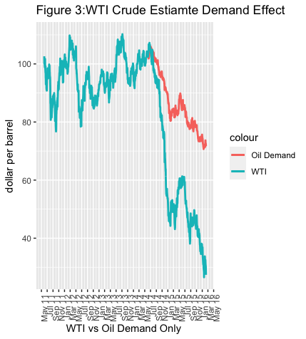

## Oil Demand Effect 2011-2016 (daily dataset)
##### Source: S&P 500: Yahoo Finance, WTI (oil): Bloomberg, Copper: Bloomberg/CME, Dollar spot index: Bloomberg, Ten-year Treasury rates: Board of Governors via Fred

### This project aims to explain WTI curde oil demand effect using WTI dataset and factors driving oil price changes for the period of 2011 to 2016 using a daily dataset. 
#### To find the oil price demand effect, we first regress the change_log (oil price ) on change_log (copper), change_og (dollar) and change in the 10 year treasury rate considering no intercept for the realzed data specified before. 
#### The table below shows the t-statictis for the regression specified below:
#### t test of coefficients:

####                Estimate Std. Error t value  Pr(>|t|)    
#### chng_logcopper  0.396981   0.035299 11.2464 < 2.2e-16 ***
#### chng_logdollar -0.741970   0.153287 -4.8404 1.573e-06 ***
#### chng_treasury   0.063208   0.012784  4.9441 9.440e-07 ***

#### Signif. codes:  0 ‘***’ 0.001 ‘**’ 0.01 ‘*’ 0.05 ‘.’ 0.1 ‘ ’ 1
#### Secondly, we generate an out-of-sample perdiction by predicting the sample oil price with the regression perdiction we run before. 
#### The last stage shows that we illustrate the predicted out of sample prediction for oil price vs the actual oil price we have dervied from WTI-Bloomberg. 

#### The graph above shows that the estimated demand effect of oil prioce we derived from out of sample selection, stand above the actual WTI oil price .It implies that oil price has declined sharply and deeply than its estimated demand from the period of Mar-2014 to Mar-2016. 
